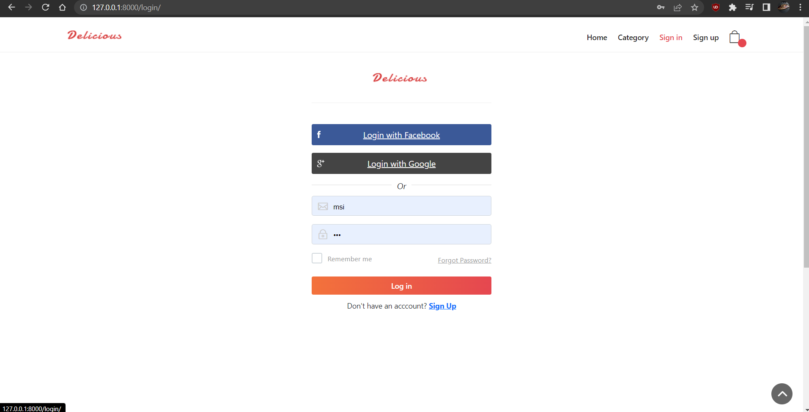

# Cuisine-Django-Project
A food web application named CUISINE made with the use of django framework, python language, sqilite database, Javascript, html and css.

## Features
- Easy Navigation
- Items Search
- Food Categories
- Registraion and login
- Profile Edit
- Password Changes
- Add to Cart 
- Cart Count
- Easy Billing
- Order History
- Registraion, billing validations

## 🛠 Skills
Python, Django, Javascript, HTML, CSS, Bootstrap...

## Screenshots
<h3>HomePage </h3>

 
<h3>Category</h3>

<h3>Category</h3>
  

<h3>Dropdown navbar</h3>
  

<h3>cart</h3>
  

<h3>empty cart</h3>
  

<h3>Login</h3>
  

<h3>Register</h3>
  

<h3>Search</h3>
  

<h3>Reset Password</h3>
  

<h3>Profile</h3>
  

<h3>Registration Validation</h3>
  

<h3>Change Password</h3>
  

<h3>Billing</h3>
  

<h3>Billing Validation</h3>
  

